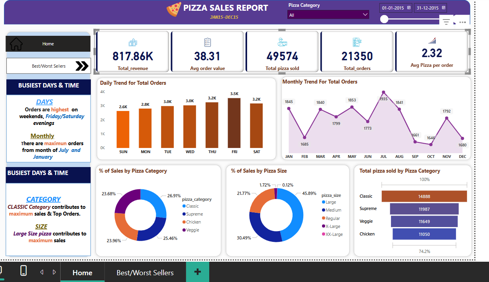

# 🍕 Power BI Pizza Sales Dashboard

## 📊 Project Overview
This Power BI project analyzes pizza sales data to uncover actionable insights such as revenue trends, best & worst sellers, and category performance.  
The dashboard provides a comprehensive view of sales by **category, size, and time**, helping stakeholders identify top-performing pizzas and optimize business decisions.

---

## 🧩 Dashboard Preview

### 🏠 Home / Overview Page


### ⭐ Best & Worst Sellers Page


---

## 📈 Key Insights
- **Total Revenue:** ₹817.86K  
- **Total Orders:** 21,350  
- **Total Pizzas Sold:** 49,574  
- **Average Order Value:** ₹38.31  
- **Average Pizzas per Order:** 2.32  
- **Busiest Days:** Friday & Saturday evenings  
- **Peak Months:** July and January  
- **Top Category:** *Classic pizzas* contributed the highest sales  
- **Top Size:** *Large pizzas* accounted for maximum sales  

---

## 🧠 Business Questions Answered
1. Which pizza categories and sizes contribute most to total revenue?  
2. What are the busiest days and months for orders?  
3. Which pizzas perform best and worst by revenue, quantity, and orders?  
4. How do seasonal and day-wise sales trends impact total performance?  

---

## ⚙️ Tools & Technologies Used
- **Power BI** → Data modeling, DAX calculations, and dashboarding  
- **SQL** → Data extraction, transformation, and aggregation  
- **Excel / CSV** → Raw dataset storage  
- **DAX** → KPIs and calculated measures  

---

## 📁 Dataset Description
The dataset contains pizza order details from a fictional store, including:
- `order_id`, `order_date`, `pizza_name`, `pizza_category`, `pizza_size`, `quantity`, and `price`.

> *(Sample dataset used for educational purposes — no confidential data.)*

---

## 🚀 How to Use This Project
1. Clone this repository:
   ```bash
   git clone https://github.com/<your-username>/powerbi-pizza-sales-dashboard.git
