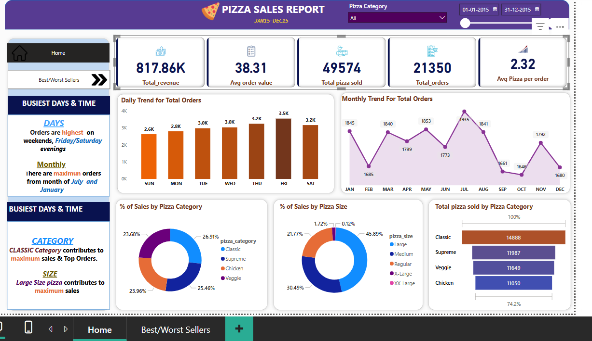
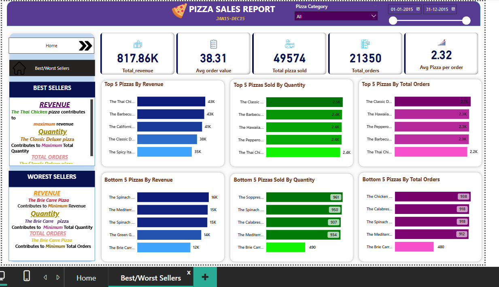

# 🍕 Pizza Sales Dashboard — SQL + Power BI

An end-to-end data analysis project analyzing pizza restaurant sales data using **SQL for data extraction** and **Power BI for interactive visualization**.

---

## 📊 Dashboard Preview

### 🏠 Overview Page


### ⭐ Best & Worst Sellers Page


---

## 🎯 Project Objective

A pizza restaurant chain wanted to understand their sales performance better. This project answers key business questions using raw order data — helping identify what's working, what's not, and when customers order the most.

---

## 📈 Key Business Insights

| KPI | Value |
|---|---|
| 💰 Total Revenue | $817,860 |
| 🧾 Total Orders | 21,350 |
| 🍕 Total Pizzas Sold | 49,574 |
| 💵 Average Order Value | $38.31 |
| 🍕 Average Pizzas per Order | 2.32 |

### Findings
- **Busiest Days:** Friday & Saturday evenings drive the highest order volume
- **Peak Months:** July and January see maximum sales — likely tied to summer and holiday seasons
- **Top Category:** Classic pizzas contribute the highest revenue and order count
- **Top Size:** Large pizzas account for the maximum sales across all categories
- **Worst Performer:** The Brie Carre pizza consistently underperforms across revenue, quantity, and orders

---

## 🧠 Business Questions Answered

1. What is the daily and monthly trend of total orders?
2. Which pizza categories and sizes contribute most to total revenue?
3. What percentage of sales does each category and size represent?
4. Which are the top 5 and bottom 5 pizzas by revenue, quantity, and orders?
5. What are the busiest days and time periods for the restaurant?

---

## ⚙️ Tools & Technologies

| Tool | Purpose |
|---|---|
| **SQL (MS SQL Server)** | Data extraction, cleaning, aggregation |
| **Power BI** | Interactive dashboard and visualization |
| **DAX** | Calculated measures and KPIs |
| **Excel / CSV** | Raw data source |

---

## 🗄️ SQL Queries Used

All SQL queries used to extract and validate data are in [`pizza_queries.sql`](pizza_queries.sql)

### Sample Queries

**Total Revenue:**
```sql
SELECT ROUND(SUM(total_price), 2) AS Total_Revenue 
FROM pizza_sales;
```

**Daily Order Trend:**
```sql
SELECT 
    DATENAME(DW, order_date) AS order_day,
    COUNT(DISTINCT order_id) AS total_orders
FROM pizza_sales
GROUP BY DATENAME(DW, order_date);
```

**Top 5 Pizzas by Revenue:**
```sql
SELECT TOP 5 
    pizza_name,
    ROUND(SUM(total_price), 2) AS total_revenue
FROM pizza_sales
GROUP BY pizza_name
ORDER BY total_revenue DESC;
```

---

## 📐 DAX Measures Used

```dax
-- Average Order Value
Avg Order Value = DIVIDE([Total Revenue], [Total Orders])

-- Average Pizzas Per Order
Avg Pizzas Per Order = DIVIDE([Total Pizzas Sold], [Total Orders])

-- % Sales by Category
% Sales by Category = 
DIVIDE(
    SUM(pizza_sales[total_price]),
    CALCULATE(SUM(pizza_sales[total_price]), ALL(pizza_sales[pizza_category]))
)
```

---

## 📁 Dataset Description

The dataset contains pizza order-level data from a fictional restaurant chain with the following fields:

| Column | Description |
|---|---|
| `order_id` | Unique order identifier |
| `order_date` | Date of the order |
| `pizza_name` | Name of the pizza ordered |
| `pizza_category` | Category (Classic, Supreme, Veggie, Chicken) |
| `pizza_size` | Size (S, M, L, XL, XXL) |
| `quantity` | Number of pizzas ordered |
| `unit_price` | Price per pizza |
| `total_price` | Total price for that line item |

> Sample dataset used for educational and portfolio purposes.

---

## 📂 Project Structure

```
Pizza-Sales-Dashboard/
│
├── Screenshots/
│   ├── dashboard_overview.png
│   └── best_worst_sellers.png
│
├── pizza_queries.sql       ← All SQL queries used
├── SQL-POWER-BI_REPORT.pbix ← Power BI file
└── README.md
```

---

## 🚀 How to Use This Project

1. Clone this repository:
```
git clone https://github.com/thahirsd01/Power-bi-pizza-sales-dashboard.git
```

2. Open `pizza_queries.sql` in SQL Server Management Studio (SSMS) and run queries against your dataset

3. Open `SQL-POWER-BI_REPORT.pbix` in Power BI Desktop to explore the dashboard

---

## 💡 What I Learned

- Writing complex SQL queries involving GROUP BY, ORDER BY, DATENAME, and aggregate functions
- Building relationships between tables in Power BI data model
- Creating DAX measures for dynamic KPI calculations
- Designing a clean two-page dashboard with slicers and drill-through filters
- Validating Power BI results against SQL query outputs for accuracy

---

## 🔗 Connect With Me

- GitHub: [thahirsd01](https://github.com/thahirsd01)
